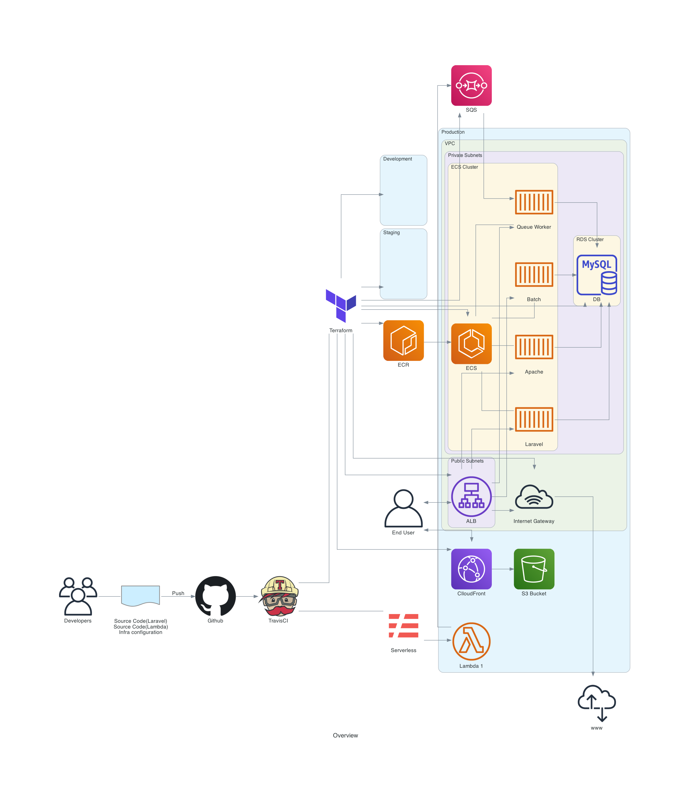

# terraform-practice
## Overview

This project is for IaC studying.

The infrastructure resources will be automatically deployed as below.



And also, it should be noted that all secret credentials are encrypted by:

- TravisCI
- AWS SSM
- [beyondcode/laravel-credentials](https://github.com/beyondcode/laravel-credentials)

## Getting Started

> For now, supported Terraform workspace name is only "dev".
> For supporting multiple workspaces, ACM resources should be deployed manually just like Route53 host zone.

### Prerequisites

* [Docker](https://www.docker.com/)
* [Terraform](https://www.terraform.io/)
* [Serverless framework](https://www.serverless.com/)
* TravisCI account and commandline tools - https://travis-ci.com/
* AWS credentials

```sh
$ docker --version
Docker version 20.10.5, build 55c4c88

$ terraform --version
Terraform v0.14.9

$ sls --version
Framework Core: 2.33.1
Plugin: 4.5.3
SDK: 4.2.2
Components: 3.8.1

$ travis --version
1.10.0

$ bat ~/.aws/credentials -p
[default]
aws_access_key_id = XXXXXXXXX
aws_secret_access_key = XXXXXXXXXXXXXX
```

### Preparation

- Create your Route53 hosted zone
- Create S3 bucket for storing tfstate
- Change `infra/variables.tf`

You must change the variable `hosted_domain` to values that you created.

- Change `infra/main.tf`

```
  backend "s3" {
    bucket = "**Change this to your bucket name you just created!**"
    key    = "terraform.tfstate"
    region = "us-east-1"
  }
```

### Deploy from your machine

- clone this repo and cd
- Deploy AWS resources

```sh
$ terraform init
$ terraform workspace add dev
$ terraform apply
yes
```

- generate ENCRYPT_KEY to `app/laravel/key.txt` (32 strings)

You can use: [Secure Password Generator](https://passwordsgenerator.net/)

- Application setup

```sh
$ cd app
$ copy `.env.example` to `.env`
$ docker-compose build --build-arg ENCRYPT_KEY=$(cat ./laravel/key.txt)
$ docker-compose up -d
$ docker-compose exec web bash
# in web container
$ php artisan credentials:edit
# Set the value referring to app/laravel/credential.sample.json and save it.
# You can find the Database credentials at AWS Systems Manager Parameter stores!

# exit from web container
$ exit
```

- Deploy application

```sh
$ aws ecr get-login-password --region us-east-1 | docker login --username AWS --password-stdin ${YOUR_ACCOUNT_ID}.dkr.ecr.us-east-1.amazonaws.com
$ export ECR_URI_APACHE=$(aws ecr describe-repositories --repository-names terraform-practice-dev-apache --region us-east-1 --query 'repositories[0].repositoryUri' --output text)
$ export ECR_URI_LARAVEL=$(aws ecr describe-repositories --repository-names terraform-practice-laravel --region us-east-1 --query 'repositories[0].repositoryUri' --output text)
$ docker build -t ${ECR_URI_LARAVEL} ./laravel --build-arg ENCRYPT_KEY=${ENCRYPT_KEY}
$ docker build -t ${ECR_URI_APACHE} -f ./laravel/docker/apache/Dockerfile ./laravel
$ docker push ${ECR_URI_LARAVEL}
$ docker push ${ECR_URI_APACHE}
```

- Deploy static resources and Lambda

```sh
$ cd serverless
$ sls deploy --stage dev
```

## Deploy from TravisCI

TODO, but you can refer to `.travis.yml`!